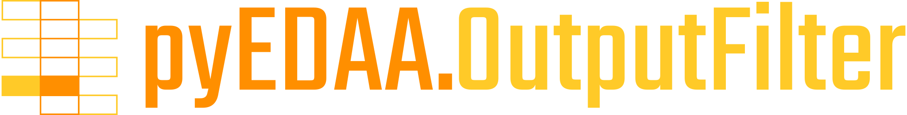

.. _EDAA:CLI:

Interacting with CLIs
#####################

|br|

|br|

.. image:: _static/logo/pyEDAA.ToolSetup.svg
   :height: 80 px
   :align: center
   :target: https://github.com/edaa-org/pyEDAA.ToolSetup

|br|

|br|

|br|

.. toctree::
   :hidden:

   pyTooling.CLIAbstraction ➚ <https://pyTooling.github.io/pyTooling.CLIAbstraction>
   pyEDAA.CLITool ➚ <https://edaa-org.github.io/pyEDAA.CLITool>
   pyEDAA.ToolSetup ➚ <https://edaa-org.github.io/pyEDAA.ToolSetup>
   pyEDAA.OutputFilter ➚ <https://edaa-org.github.io/pyEDAA.OutputFilter>
   pyEDAA.Launcher ➚ <https://edaa-org.github.io/pyEDAA.Launcher>
