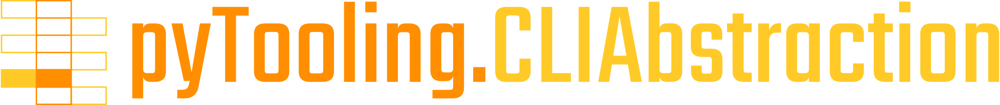
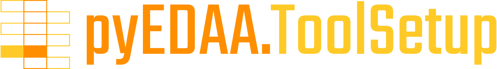

.. _EDAA:CLI:

Interacting with CLIs
#####################

CLIAbstraction
==============

.. centered:: |SHIELD:svg:CLIAbstraction|

`pyTooling.CLIAbstraction ➚ <https://pyTooling.github.io/pyTooling.CLIAbstraction>`_ is an abstraction of command line programs written in Python, so *command line interfaces*
(CLIs) are accessible as Python classes. The abstraction offers an easy to use API to define possible program options as
typed fields on a class. When such an abstracted program is executed, it takes care of assembling CLI options in the
right order, with correct parameter value formatting and escaping if needed. It also takes care of calling
``subprocess.run(...)`` appropriately as well as handling outputs as realtime streamed data for post-processing.

CLITool
=======

.. |SHIELD:svg:CLITool| image:: _static/logo/pyEDAA.CLITool.svg
   :alt: pyEDAA.CLITool
   :height: 60
   :target: https://github.com/edaa-org/pyEDAA.CLITool

.. centered:: |SHIELD:svg:CLITool|

`pyEDAA.CLITool ➚ <https://edaa-org.github.io/pyEDAA.CLITool>`_ is collection of EDA tool's CLI program abstractions using **pyTooling.CLIAbstraction**. Open source
tools as well as commercial tools are supported. When the abstracted executable is launched, it's either searched in
``PATH`` or a path to the binary directory of the tools needs to be specified. The latter can be provided by
**pyEDAA.ToolSetup**.

ToolSetup
=========

.. centered:: |SHIELD:svg:ToolSetup|

`pyEDAA.ToolSetup ➚ <https://edaa-org.github.io/pyEDAA.ToolSetup>`_ offers a generalized data structure where to find a specific EDA tool on a local machine and how
that tool installation is configured. In addition, it can find various tool installation on a machine and manage an
inventory of all EDA tools, their versions and variants, even when an EDA tool was installed multiple times in parallel.
The inventory is offering an API to be accessible by any 3\ :sup:`rd`-party Python code for reading and/or modifying
that inventory. The inventory storage format can be any dictionary-like data structure. Inventories can be created,
managed and stored per machine, user account or EDA project (directory).

OutputFilter
============

.. centered:: |SHIELD:svg:OutputFilter|

`pyEDAA.OutputFilter ➚ <https://edaa-org.github.io/pyEDAA.OutputFilter>`_ takes a stream of text lines (command line log) from EDA tool's CLI programs and translates them
into a stream of structured data. Each text line is classified and decomposed into individual data fields. This stream
can then be post-processed with filters, transformations, statistics, etc.

Launcher
========

.. |SHIELD:svg:Launcher| image:: _static/logo/pyEDAA.Launcher.svg
   :alt: pyEDAA.Launcher
   :height: 60
   :target: https://github.com/edaa-org/pyEDAA.Launcher

.. centered:: |SHIELD:svg:OutputFilter|

`pyEDAA.Launcher ➚ <https://edaa-org.github.io/pyEDAA.Launcher>`_

.. TODO::

   Needs a short description paragraph.
