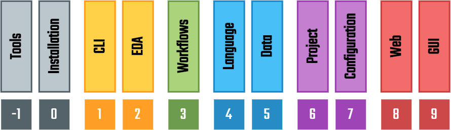

.. _EDAA:Concept:

Conceptual Model
################

EDA² is a conceptual model for characterising the abstraction layers in Electronic Design Automation projects based on
Hardware Description Languages (HDLs).
Its goal is the interoperability of diverse tools and languages with documented APIs.

.. IMPORTANT::
  This conceptual model is not meant to be an isolated full-stack, but each of the layers is to be useful and (re)usable.
  In fact, it is still being enhanced and reworked, so the naming and specific scope of the layers should be taken with
  a grain of salt.

   Layers of the EDA² conceptual model.

-1 | Installation
    Packaging and distribution of EDA tools.
    Organisation `github.com/hdl <https://github.com/hdl>`__ contains an index of packaging solutions (`hdl/packages <https://github.com/hdl/packages>`__),
    along with `hdl/smoke-tests <https://github.com/hdl/smoke-tests>`__ for packagers to test the artifacts.
    This layer includes the abstraction(s) for dealing with multiple versions of the tools installed in different
    locations.

0 | CLI
    Abstraction of Command-Line Interface programs (independent of EDA tools).
    May include the abstraction for running isolated tools on containers (e.g. from `hdl/containers <https://github.com/hdl/containers>`__).

1 | EDA
    Interaction with EDA tools (both open source and vendors), including multiple version support, output
    filtering, etc.
    See :ref:`OSVB: Logging <OSVB:API:Logging>`.

2 | Workflows
    Middle layer to translate projects into execution steps (EDA and/or CLI).
    See :ref:`OSVB: Tool <OSVB:API:Tool>` and :ref:`OSVB: Runner <OSVB:API:Runner>`.

3 | Language Model
    Syntax/design Document Object Model (DOM) of the language(s).
    See :ref:`OSVB: pyVHDLModelUtils <OSVB:API:Project:pyVHDLModelUtils>`.

4 | Project
    Tool independent information (files/filesets, primary design units, testbenches, `hdl/constraints <https://github.com/hdl/constraints>`__,
    etc.) and tool specific parameters.

5 | Configuration
    INI/JSON/YAML format for providing the data used in Workflow and/or Project through files, instead of using the APIs.
    See :ref:`OSVB: Core <OSVB:API:Core>`.

6 | Web
    Web API wrapping the previous layers.

7 | GUI
    Visual frontend to the web API or to the previous layers.
    See :ref:`OSVB: Open Source VHDL Design Explorer (OSVDE) <OSVB:API:Project:OSVDE>`.
