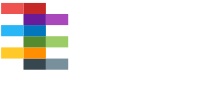

  <!--
  -->
  <!--
  -->
  <!--
  -->
  <!--
  -->

# Electronic Design Automation Abstraction (EDA²)

Electronic Design Automation Abstraction (EDA²) is a conceptual model for characterising the abstraction layers in Electronic Design Automation (EDA) projects based on Hardware Description Languages (HDLs).
Its goal is the interoperability of diverse tools and languages, through documented interfaces.

  

EDA² aims to provide reference Python implementations and schemas of commonly needed software layers for (open source) EDA tooling/frameworks to reduce code duplication and reinventions of existing algorithms and data structures.
Each layer solves the problems at a different abstraction level, hence, they are organised accordingly:

  

Although all the resources provided through EDA² can be used together, that is not a requirement.
Third parties are expected to (re)use only the subset of layers that allows them to reduce the maintenance burden of their codebase, while preserving the functionality and UX expected by their user base.
In fact, pyEDAA modules are based on Object Oriented Programming (OOP) patterns, to allow enhancements through inheritance and overriding.

Overall, EDA² provides building blocks to develop GUI solutions such as:

  <!--
  -->
  <!--
  -->

or CLI workflows and tooling:

  <!--
  -->
  <!--
  -->
  <!--
  -->
  <!--
  -->
  <!--
  -->
  <!--
  -->
  <!--
  -->
  <!--
  -->
  <!--
  -->
  <!--
  -->
  <!--
  -->
  <!--
  -->

That is achieved through a series of tool interfaces:

  <!--
  -->
  <!--
  -->
  <!--
  -->

along with syntax/document object models for language and specifications:

  <!--
  -->
  <!--
  -->
  <!--
  -->
  <!--
  -->

and project abstractions with matching configuration file formats:

  <!--
  -->

The end goal is to close the gaps between existing tool, project and HDL source management solutions;
to ease the usage of common and not-so-popular tools in the EDA industry:

  <!--
  -->
  <!--
  -->
  <!--
  -->
  <!--
  -->
  <!--
  -->
  <!--
  -->
  <!--
  -->
  <!--
  -->

  <!--
  -->
  <!--
  -->
  <!--
  -->
  <!--
  -->
  <!--
  -->
  <!--
  -->
  <!--
  -->
  <!--
  -->
  <!--
  -->
  <!--
  -->

