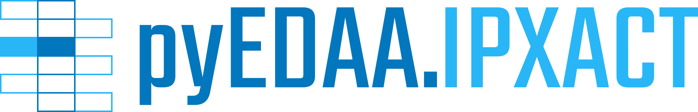

.. _EDAA:SyntaxModels:

Languages and Syntax
####################

.. image:: _static/logo/pyVHDLModel.svg
   :height: 80 px
   :align: center
   :target: https://github.com/vhdl/pyVHDLModel

.. raw:: html

     

.. image:: _static/logo/pySVModel.svg
   :height: 80 px
   :align: center
   :target: https://github.com/edaa-org/pySVModel

.. raw:: html

     

.. image:: _static/logo/pyEDAA.Reports.svg
   :height: 80 px
   :align: center
   :target: https://github.com/edaa-org/pyEDAA.Reports

.. raw:: html

     

.. image:: _static/logo/pyEDAA.UCIS.svg
   :height: 80 px
   :align: center
   :target: https://github.com/edaa-org/pyEDAA.UCIS

.. raw:: html

     

.. raw:: html

     

.. toctree::
   :hidden:

   pyVHDLModel ➚ <https://vhdl.github.io/pyVHDLModel>
   pySVModel ➚ <https://edaa-org.github.io/pySVModel>
   pyEDAA.Reports ✗ <https://edaa-org.github.io/pyEDAA.Reports>
   pyEDAA.UCIS ✗ <https://edaa-org.github.io/pyEDAA.UCIS>
   pyEDAA.IPXACT ✗ <https://edaa-org.github.io/pyEDAA.IPXACT>
